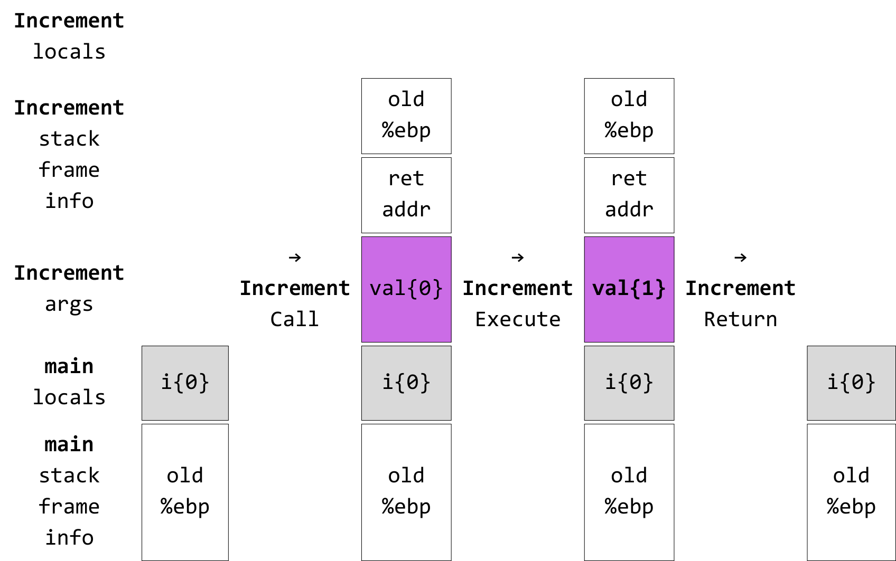
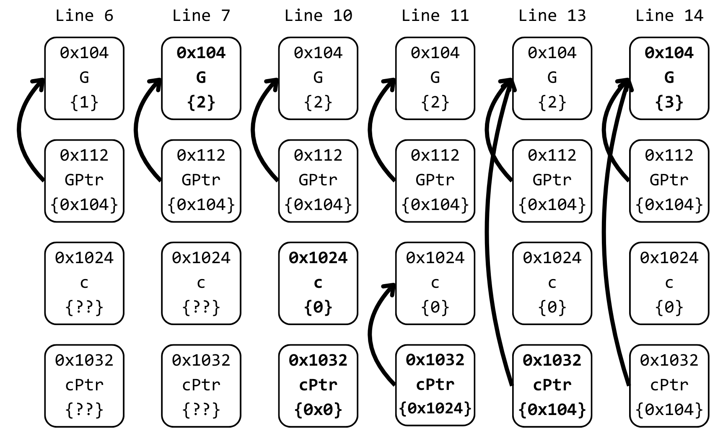

📚 CS240 - Data Structures 📚  
⛄️ Winter 2024 ⛄️

---

### Types & Variables

- Visualize variables as blocks in memory
- Variable properties
  - Address, Size, Value
- Size
  - Associated with its type
  - Determines offset among addresses

```c []
long L = 2;
const char C = 'A';
int main() {
    int a = 0;
    const char c = 'a';
    char* p = NULL;
}
```

===


---

### `sizeof` operator

- Primitive types have their size defined at compile time
- `sizeof` operator returns size of type/variable in bytes

```c []
int main() {
      char a = '0';
      printf("%d ", sizeof(a));
      printf("%d ", sizeof(char));
      printf("%d ", sizeof(int));
      printf("%d ", sizeof(bool));
      printf("%d ", sizeof(double));
      printf("%d ", sizeof(char*));
      printf("%d ", sizeof(long*));
      printf("%d ", sizeof(void*));
}
```

```shell
1 1 4 1 8 8 8 8
```

<!-- .element: class="fragment fade-in" data-fragment-index="1" -->

---

### Compiling

```bash
gcc -g -O0 -std=c99 -Wall -Wextra -Wpedantic -o main main.c
```

- `-g` debug symbols
- `-O0` disable optimizations
- `-std=c99` pick language standard ISO C99
- `-Wall` warnings
- `-Wextra` more warnings
- `-Wpedantic` strict ISO C compliance warnings

notes:

- Prefer picking the latest language standard like C11, or even C23.
- Gives you access to useful language features.
- Always check compiler support for picked standard.
- Compilers installed in department machines may not support the latest standards.

[Compiler Support](https://en.cppreference.com/w/c/compiler_support)

---

### Compile Chain


===

- **Preprocessor** parses `#include` and `#define` directives
- **Compiler** with assembler produce a machine instruction object file `.o` from a source code `.c` file
- **Linker** combines object files to a single executable `.out/.exe`

---

### Debugging

Live Demo  
🎉

notes:

- hello world program with local vars and a function
- run on wsl
- build using vscode tasks
- build using makefile
- configure launch.json and run gdb

---

### Operators

```c []
int main() {
    int a = 3 + 2;
    int b = 3 - 1;
    int c = a % b;
    printf("%d\n", c);
    int d = c++;
    printf("%d\n", d);
    d = --c;
    printf("%d\n", d);
    bool e = a < c;
    if (e) printf("less\n");
    else if (a == c) printf("equal\n");
    else printf("greater equal\n");
}
```

```shell
1
1
1
greater equal
```

<!-- .element: class="fragment fade-in" data-fragment-index="1" -->

===

- Visualize each operator as a function
  - Takes one/two arguments
  - Returns a value
  - May modify the state of its arguments


---

### Precedence & Associativity

- Precedence
  - Which is evaluated first
- Associativity
  - On same precedence, evaluate Left-to-Right or Right-to-Left

```c []
int main() {
    int a = 3 * 2 + 1; // Precedence
    int b = 6;
    int c = 5;
    a = b = c = 10; // Associativity Right-to-Left
}
```

[Operator Precedence Table (Link)](https://en.cppreference.com/w/c/language/operator_precedence)

---

### Scope

- Brackets can cause scope change
- We can only access variables of active scopes
- Global scope is always active

```c []
const bool c = false;
int main() {
    int a = 1;
    {
        int b = 2;
        {
            int c = 3; // shadowing
            printf("%d %d %d\n", a, b, c);
        }
    }
    // a = b; //compiler error
}
```

```shell
1 2 3
```

<!-- .element: class="fragment fade-in" data-fragment-index="1" -->

---

### `enum` - `typedef`

- An `enum` variable can hold one of predefined values
- Keyword `typedef` used to alias a type name

===

```c []
enum Color {
    Red,
    Green,
    Blue,
};
typedef enum Color Color;
int main() {
    printf("%d\n", sizeof(Color));
    Color c = Red;
    // enum Color c = Red; //Syntax without typedef
    if (c == Red)           printf("Red\n");
    else if (c == Green)    printf("Green\n");
    else if (c == Blue)     printf("Blue\n");
    else                    printf("Error\n");
}
```

```shell
4
Red
```

<!-- .element: class="fragment fade-in" data-fragment-index="1" -->

---

### Switch

`if/else` syntax suitable for `enums/ints`

```c []
enum Color {
    Red,
    Green,
    Blue,
};
typedef enum Color Color;
int main() {
    Color c = Green;
    switch (c) {
        case Red:   printf("Red\n");    break;
        case Green: printf("Green\n");  break;
        case Blue:  printf("Blue\n");   break;
        default:    printf("Error\n");
    }
}
```

```shell
Green
```

<!-- .element: class="fragment fade-in" data-fragment-index="1" -->

---

### Loops

```c []
int main() {
    const int limit = 10;
    int i = 0;
    while (i < limit) {
        printf("%d ", i);
        i += 1;
    }
    printf("\n");
    for (int i = 0; i < limit; ++i) printf("%d ", i);
    printf("\n");
}
```

```shell
1 2 3 4 5 6 7 8 9
1 2 3 4 5 6 7 8 9
```

<!-- .element: class="fragment fade-in" data-fragment-index="1" -->

===

```c []
int main() {
    int j = 3;
    bool isDone = false;
    while(!isDone) {
        printf("[%d %d] ", j, isDone);
        if (j > 0) { --j; continue; }
        isDone = true;
    }
    printf("\n");
    for(;;) {
        printf("before break\n");
        break;
    }
}
```

```shell
[3 0] [2 0] [1 0] [0 0]
before break
```

<!-- .element: class="fragment fade-in" data-fragment-index="1" -->

---

### Functions

Reusable pieces of code

```c []
bool IsEven(int val) {return (val % 2) == 0;}
void PrintEven(int val, bool isEven) {
    if(isEven) printf("%d is Even\n", val);
}
int main() {
    for (int i = 0; i < 5; ++i)
        PrintEven(i, IsEven(i));
}
```

```shell
0 is Even
2 is Even
4 is Even
```

<!-- .element: class="fragment fade-in" data-fragment-index="1" -->

notes:

- Difference between IsEven and isEven?
- Description of IsEven in high level words

===

### Call-By-Value

```c []
void Increment(int val) {
    val += 1;
    printf("%d\n", val);
}
int main() {
    int i = 0;
    printf("%d\n", i);
    Increment(i);
    printf("%d\n", i);
}
```

```shell
0
1
0
```

<!-- .element: class="fragment fade-in" data-fragment-index="1" -->

===



===

### Recursion

```c []
int Pow(int base, int exp) {
    if (exp == 0) return 1;
    return base * Pow(base, exp - 1);
}
int main() {
    printf("%d\n", Pow(2, 10));
}
```

```shell
1024
```

<!-- .element: class="fragment fade-in" data-fragment-index="1" -->

---

### Pointers

The value of a pointer variable is a memory address

```c []
int G = 1;
int* const GPtr = &G;
int main() {
    printf("%d ", sizeof(int*));
    printf("%d\n", sizeof(char*));
    *GPtr = 2;
    printf("%p %d %p %d\n", &G, G, GPtr, *GPtr);
    int c = 0;
    int* cPtr = NULL;
    cPtr = &c;
    printf("%p %d %p %d\n", &c, c, cPtr, *cPtr);
    cPtr = GPtr;
    *cPtr += 1;
    printf("%p %d %p %d\n", &G, G, GPtr, *GPtr);
}
```

```shell
8 8
0x404018 2 0x404018 2
0x7ffdf15d3904 0 0x7ffdf15d3904 0
0x404018 3 0x404018 3
```

<!-- .element: class="fragment fade-in" data-fragment-index="1" -->

notes:

- Dereference `*` operator used to access the value stored at the memory location pointed to by a pointer
- Address of `&` operator is used to obtain the memory address of a variable

===



===

### Call-By-Reference Trick

```c []
void Increment(int* val) {
    *val += 1;
    printf("%d\n", *val);
}
int main() {
    int i = 0;
    printf("%d\n", i);
    Increment(&i);
    printf("%d\n", i);
}
```

```shell
0
1
1
```

<!-- .element: class="fragment fade-in" data-fragment-index="1" -->

===


---

### Structs

Definition of new type composed by simpler types

```c []
struct Pair {
    int x;
    int y;
};
typedef struct Pair Pair;
int main() {
    printf("%d\n", sizeof(Pair));
    Pair pair1; //members uninitialized
    pair1.x = 1; pair1.y = 2;
    printf("%d %d\n", pair1.x, pair1.y);
    Pair pair2 = {.x=3, .y=4};
    printf("%d %d\n", pair2.x, pair2.y);
    Pair pair3 = pair2;
    printf("%d %d\n", pair3.x, pair3.y);
}
```

```shell
8
1 2
3 4
3 4
```

<!-- .element: class="fragment fade-in" data-fragment-index="1" -->

notes:

- Take a break before this slide

---

### C-Arrays

Size must be known at compile time

```c []
struct Pair {
    int x;
    int y;
};
typedef struct Pair Pair;
#define PAIRS_SIZE 3
int main() {
    Pair pairs1[PAIRS_SIZE]; //elements uninitialized
    printf("%d\n", sizeof(pairs1));
    for (int i = 0; i < PAIRS_SIZE; ++i)
        { pairs1[i].x=0; pairs1[i].y=0; }
    Pair pairs2[PAIRS_SIZE] = { {1, 1}, {1, 1}, {1, 1} };
    Pair pairs3[PAIRS_SIZE] = {}; //elements zero'ed
}
```

```shell
24
```

<!-- .element: class="fragment fade-in" data-fragment-index="1" -->

notes:

- `const` variables can't be used as array sizes
- `const` variables are treated internally as variables, not compile-time constants

===

### C-Arrays As Pointers

```c []
#define N_SIZE 10
void PrintArray(int* arr) {
    for (int i = 0; i < N_SIZE; ++i) printf("%d ", arr[i]);
}
int main() {
    int n[N_SIZE] = {1, 2}; //rest zero'ed
    PrintArray(n); printf("\n");
    int* const nAlias = n;
    nAlias[0] = 3; n[1] = 4;
    *(nAlias + 2) = 5; *(n + 3) = 6;
    int* const nIdxFour = n + 4; *nIdxFour = 7;
    PrintArray(n); printf("\n");
    printf("%p %p %d\n",&(n[5]),(n+5),n[5]);
    printf("%p %p %d\n",&(nAlias[5]),(nAlias+5),nAlias[5]);
}
```

```shell
1 2 0 0 0 0 0 0 0 0
3 4 5 6 7 0 0 0 0 0
0x7ffdb2f8cd74 0x7ffdb2f8cd74 0
0x7ffdb2f8cd74 0x7ffdb2f8cd74 0
```

<!-- .element: class="fragment fade-in" data-fragment-index="1" -->

---

### Dynamic Allocation

- `malloc` returns pointer to newly allocated, uninitialized memory
- `free` deallocates memory

```c []
int main() {
    int* numPtr = NULL;
    numPtr = malloc(1 * sizeof(int));
    *numPtr = 1;
    *(numPtr + 0) = 2;
    int num = *numPtr;
    printf("%p %d %p %d\n", numPtr, *numPtr, &num, num);
    free(numPtr);
}
```

```shell
0x6df2a0 2 0x7ffed055c8a4 2
```

<!-- .element: class="fragment fade-in" data-fragment-index="1" -->

notes:

- The OS frees the memory of the entire process, regardless of internal dynamic allocations
- It is good practice to always free your own resources.
- It is necessary in long running applications eg. games, to prevent memory leaks.

===

### Dynamic Allocation Of Struct

```c []
struct Pair { int x; int y; };
typedef struct Pair Pair;
int main() {
    Pair* pair = malloc(sizeof(Pair));
    (*pair).x = (*pair).y = 1;
    pair->x = pair->y = 2;
    Pair temp = {.x=3, .y=3}; *pair = temp;
    pair->x = pair->y = 4;
    Pair result = *pair;
    printf("%p %d %d\n", pair, pair->x, pair->y);
    printf("%p %d %d\n", result, result.x, result.y);
    printf("%p %d %d\n", temp, temp.x, temp.y);
    free(pair);
}
```

```shell
0xf8c2a0 4 4
0x400000004 4 4
0x300000003 3 3
```

<!-- .element: class="fragment fade-in" data-fragment-index="1" -->

===

### Dynamic Allocation Of Struct-Array

```c []
typedef struct Pair { int x; int y; } Pair;
#define PAIRS_SIZE 5
void PrintPairs(Pair* arr) {
    for (int i = 0; i < PAIRS_SIZE; ++i)
        printf("%d%d ", arr[i].x, arr[i].y); }
int main() {
    Pair* pairs = malloc(PAIRS_SIZE * sizeof(Pair));
    memset(pairs, 0, PAIRS_SIZE * sizeof(Pair));
    pairs[0].x = pairs[0].y = 1;
    (*(pairs + 1)).x = (*(pairs + 1)).y = 2;
    (pairs + 2)->x = (pairs + 2)->y = 3;
    Pair* pairsIdxThree = pairs + 3;
    pairsIdxThree->x = pairsIdxThree->y = 4;
    PrintPairs(pairs); printf("\n");
    free(pairs); }
```

```shell
11 22 33 44 00
```

<!-- .element: class="fragment fade-in" data-fragment-index="1" -->

===


---

### Defining a Singly-Linked List

```c []
struct PlayerNode {
    int id;
    int score;
    struct PlayerNode* next;
};
typedef struct PlayerNode PlayerNode;
struct PlayerList {
    PlayerNode* head;
};
typedef struct PlayerList PlayerList;
```

notes:

- Why can't I declare `next` as `PlayerNode* next`?

===

```c []
PlayerList* PlayerList_Create() {
    PlayerList* list = malloc(sizeof(PlayerList));
    list->head = NULL;
    return list;
}
void PlayerList_Destroy(PlayerList* list) {
    PlayerNode *prev = NULL;
    for (PlayerNode* p=list->head; p!=NULL; p=p->next) {
        free(prev);
        prev = p;
    }
    free(prev);
}
```

===

```c []
void PlayerList_Insert(PlayerList* list, int id) {
    PlayerNode* node = malloc(sizeof(PlayerNode));
    node->id = id;
    node->score = 0;
    node->next = NULL;

    node->next = list->head;
    list->head = node;
}
```

===

```c []
void PlayerList_Print(PlayerList* list) {
    for (PlayerNode* p = list->head; p!=NULL; p=p->next)
        printf("[%p %d %d %p]\n",p,p->id,p->score,p->next);
}
int main() {
    PlayerList* list = PlayerList_Create();
    PlayerList_Insert(list, 10);
    PlayerList_Insert(list, 20);
    PlayerList_Print(list);
    PlayerList_Destroy(list);
}
```

```shell
[0x22662e0 20 0 0x22662c0]
[0x22662c0 10 0 (nil)]
```

<!-- .element: class="fragment fade-in" data-fragment-index="1" -->

---

- 🧐 Provide feedback and report slide errors 🧐
- 🤖 A.I. generated code is strictly prohibited 🤖

---

### 🎉 Thank you 🎉
