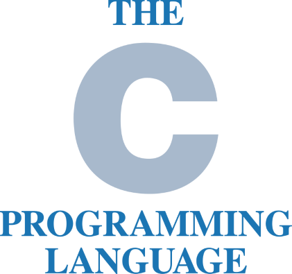

<!-- Add Recursion? -->
<!-- Add Pointer to Pointer? -->
<!-- Add Multi-Dim Array? -->
<!-- Add stack-heap allocated strings? -->
<!-- Add Arrays of Pointers? -->
<!-- Add Calloc/Realloc? -->

<!-- Don't forget shapes -->
<!-- Don't forget godbolt links and output verification -->



CS240 - Data Structures  
Winter 2024

---

### Types & Variables

- Visualize variables as blocks in memory
- Variable properties
  - Address, Size, Value
- Size
  - Associated with its type
  - Determines offset among addresses

```c []
long L = 2;
const char C = 'A';
int main() {
    int a = 0;
    const char c = 'a';
    char* p = NULL;
}
```

===


---

### `sizeof` operator

- Primitive types have their size defined at compile time
- `sizeof` operator returns size of type/variable in bytes

```c []
int main() {
      char a = '0';
      printf("%d", sizeof(a));
      printf("%d", sizeof(char));
      printf("%d", sizeof(int));
      printf("%d", sizeof(bool));
      printf("%d", sizeof(double));
      printf("%d", sizeof(char*));
      printf("%d", sizeof(long*));
      printf("%d", sizeof(void*));
}
```

```shell
output
```

---

### Compiling

```bash
gcc -Wall -Wextra -Wpedantic -std=c99 -o main main.c
```

- `-Wall` warnings
- `-Wextra` more warnings
- `-Wpedantic` strict ISO C compliance warnings
- `-std=c99` pick language standard ISO C99

notes:
Suggestion:  
Prefer picking the latest language standard like C11, or even C23.  
Gives you access to useful language features.  
Always check compiler support for picked standard.  
Compilers installed in department machines may not support the latest standards.

[Compiler Support](https://en.cppreference.com/w/c/compiler_support)

---

### Compile Chain


===

- **Preprocessor** parses your `#include` and `#define` directives
- **Compiler** with assembler produce a machine instruction object file `.o` from a source code `.c` file
- **Linker** combines object files to a single executable `.out/.exe`

---

### Debugging

Live Demo

notes:

- hello world with some variables
- build on vscode with wsl
- configure and run gdb

---

### Operators

```c []
int main() {
    int a = 3 + 2;
    int b = 3 - 1;
    int c = a % b;
    printf("%d\n", c);
    int d = c++;
    printf("%d\n", d);
    d = --c;
    printf("%d\n", d);
    bool d = a < c;
    if (d) printf("less\n");
    else if (a == c) printf("equal\n");
    else printf("greater equal\n");
}
```

```shell
3
3
3
greater equal
```

===

- Visualize each operator as a function
  - Takes one/two arguments
  - Returns a value
  - May modify the state of its arguments


---

### Precedence & Associativity

- Precedence
  - Which is evaluated first
- Associativity
  - On same precedence, evaluate Left-to-Right or Right-to-Left

```c []
int main() {
    int a = 3 * 2 + 1; // Precedence
    int b = 6;
    int c = 5;
    a = b = c = 10; // Associativity Right-to-Left
}
```

[Operator Precedence Table (Link)](https://en.cppreference.com/w/c/language/operator_precedence)

---

### Scope

- Brackets can cause scope change
- We can only access variables of active scopes
- Global scope is always accessible

```c []
const bool c = false;
int main() {
    int a = 1;
    {
        int b = 2;
        {
            int c = 3; // shadowing
            printf("%d %d %d\n", a, b, c);
        }
    }
    // a = b; //compiler error
}
```

```shell
1 2 3
```

---

### `enum` - `typedef`

- An `enum` variable can hold one of predefined values
- Keyword `typedef` used to alias a type name

===

```c []
enum Color {
    Red,
    Green,
    Blue,
};
typedef enum Color Color;
int main() {
    printf("%d\n",sizeof(Color));
    Color c = Red;
    // enum Color c = Red; //Syntax without typedef
    if (c == Red)           printf("Red\n");
    else if (c == Green)    printf("Green\n");
    else if (c == Blue)     printf("Blue\n");
    else                    printf("Error\n");
}
```

```shell
8
Red
```

---

### Switch

`if/else` syntax suitable for `enums/ints`

```c []
enum Color {
    Red,
    Green,
    Blue,
};
typedef enum Color Color;
int main() {
    Color c = Green;
    switch (c) {
        case Red:   printf("Red\n");    break;
        case Green: printf("Green\n");  break;
        case Blue:  printf("Blue\n");   break;
        default:    printf("Error\n");
    }
}
```

```shell
Green
```

---

### Loops

```c []
int main() {
    const int limit = 10;
    int i = 0;
    while (i < limit) {
        printf("%d ", i);
        i += 1;
    }
    printf("\n");
    for (int i = 0; i < limit; ++i) printf("%d ", i);
    printf("\n");
}
```

```shell
1 2 3 4 5
1 2 3 4 5
```

===

```c []
int main() {
    int j = 3;
    bool isDone = false;
    while(!isDone) {
        printf("{%d %d} \n", j, isDone);
        if (j > 0) { --j; continue; }
        isDone = true;
    }
    printf("\n");
    for(;;) {
        printf("before break\n");
        break;
    }
}
```

```shell
{3 0} {2 0} {1 0}
before break
```

---

### Functions

Reusable pieces of code

```c []
bool IsEven(int val) {return val % 2;}
void PrintEven(int val, bool isEven) {
    if(isEven) printf("%d is Even\n", val, isEven);
}
int main() {
    for (int i = 0; i < 5; ++i)
        PrintEven(i, IsEven(i));
}
```

```shell
output here
```

notes:
difference between IsEven and isEven

===

### Call-By-Value

```c []
void Increment(int val) {
    val += 1;
    printf("%d\n", val);
}
int main() {
    int i = 0;
    printf("%d\n", i);
    Increment(i);
    printf("%d\n", i);
}
```

```shell
0
1
0
```

Need blocks of stack frames here

---

### Pointers

The value of a pointer variable is a memory address

```c []
int G = 1;
int* const GPtr = &G;
int main() {
    printf("%d\n", sizeof(int*));
    printf("%d\n", sizeof(char*));
    *GPtr = 2;
    printf("%p %d %p %d\n", &G, G, GPtr, *GPtr);
    char c = '0';
    char* const cPtr = NULL;
    cPtr = &c;
    printf("%p %d %p %d\n", &c, c, cPtr, *cPtr);
    cPtr = GPtr;
    *cPtr += 1;
    printf("%p %d %p %d\n", &G, G, GPtr, *GPtr);
}
```

```shell
output
```

Need blocks of memory here

notes:
Dereference `*` operator used to access the value stored at the memory location pointed to by a pointer  
Address of `&` operator is used to obtain the memory address of a variable

===

### Call-By-Reference Trick

```c []
void Increment(int* val) {
    *val += 1;
    printf("%d\n", *val);
}
int main() {
    int i = 0;
    printf("%d\n", i);
    Increment(&i);
    printf("%d\n", i);
}
```

```shell
0
1
1
```

Need blocks of stack frames here

---

### Structs

Definition of new type composed by simpler types

```c []
struct Pair {
    int x;
    int y;
};
typedef struct Pair Pair;
int main() {
    printf("%d\n", sizeof(Pair));
    Pair pair1; //members uninitialized
    pair1.x = 1 = pair1.y = 2;
    printf("%d %d\n", pair1.x, pair1.y);
    Pair pair2 = {.x=3, .y=4};
    printf("%d %d\n", pair2.x, pair2.y);
    Pair pair3 = pair2;
    printf("%d %d\n", pair3.x, pair3.y);
}
```

```shell
1 2
3 4
3 4
```

---

### C-Arrays

Size must be known at compile time

```c []
struct Pair {
    int x;
    int y;
};
typedef struct Pair Pair;
#define PAIRS_SIZE 3
int main() {
    Pair pairs1[PAIRS_SIZE]; //elements uninitialized
    printf("%d\n", sizeof(pairs1));
    for (int i = 0; i < PAIRS_SIZE; ++i)
        { pairs[i].x=0; pairs[i].y=0; }
    Pair pairs2[PAIRS_SIZE] = { {1, 1}, {1, 1}, {1, 1} };
    Pair pairs3[PAIRS_SIZE] = {}; //elements zero'ed
}
```

```shell
output
```

===

### C-Arrays As Pointers

```c []
#define N_SIZE 10
void PrintArray(int* arr) {
    for (int i = 0; i < N_SIZE; ++i) printf("%d ", arr[i]);
}
int main() {
    int n[N_SIZE] = {1, 2}; //rest zero'ed
    PrintArray(n); printf("\n");
    int* const nAlias = n;
    nAlias[0] = 3; n[1] = 4;
    *(nAlias + 2) = 5; *(n + 3) = 6;
    int* const nIdxFive = n + 5; *nIdxFive = 7;
    PrintArray(n); printf("\n");
    printf("%p %p\n", &(n[6]), (n + 6));
    printf("%p %p\n", &(nAlias[6]), (nAlias + 6));
}
```

```shell
output
```

---

### Dynamic Allocation

- `malloc` returns pointer to newly allocated, uninitialized memory
- `free` deallocates memory

```c []
int main() {
    int* numPtr = NULL;
    numPtr = malloc(1 * sizeof(int));
    *numPtr = 1;
    *(numPtr + 0) = 2;
    int num = *numPtr;
    printf("%p %d %p %d\n", numPtr, *numPtr, &num, num);
    free(numPtr);
}
```

```shell
output
```

===

### Dynamic Allocation Of Struct

```c []
struct Pair { int x; int y; };
typedef struct Pair Pair;
int main() {
    int* pair = malloc(sizeof(Pair));
    (*pair).x = (*pair).y = 1;
    pair->x = pair->y = 2;
    Pair temp = {.x=3, .y=3}; *pair = temp;
    pair->x = pair->y = 4;
    Pair result = *pair;
    printf("%p %d %d\n", pair, pair->x, pair->y);
    printf("%p %d %d\n", result, result->x, result->y);
    printf("%p %d %d\n", temp, temp.x, temp.y);
    free(pair);
}
```

```shell
output
```

===

### Dynamic Allocation Of Struct-Array

```c []
typedef struct Pair { int x; int y; } Pair;
#define PAIRS_SIZE 5
void PrintPairs(Pairs* arr) {
    for (int i = 0; i < N_SIZE; ++i)
        printf("%d %d", arr[i].x, arr[i].y); }
int main() {
    Pair* pairs = malloc(PAIRS_SIZE * sizeof(Pair));
    memset(pairs, 5, PAIRS_SIZE * sizeof(Pair));
    pairs[0].x = pairs[0].y = 1;
    *(pairs + 1).x = *(pairs + 1).y = 2;
    (pairs + 2)->x = (pairs + 2)->y = 3;
    Pair* pairsIdxThree = pairs + 3;
    pairsIdxThree->x = pairsIdxThree->y = 4;
    PrintPairs(pairs); printf("\n");
    free(pairs); }
```

```shell
output
```

Need blocks of memory here

---

### Defining a Singly-Linked List

```c []
struct PlayerNode {
    int id;
    int score;
    struct PlayerNode* next;
};
typedef struct PlayerNode PlayerNode;
struct PlayerList {
    Player* head;
};
typedef struct PlayerList PlayerList;
```

===

```c []
void PlayerList_Create() {
    PlayerList* list = malloc(sizeof(PlayerList));
    list->head = NULL;
    return list;
}
void PlayerList_Destroy(PlayerList* list) {
    PlayerNode *prev = NULL;
    for (PlayerNode* p=list->head; p!=NULL; p=p->next) {
        free(prev);
        prev = p;
    }
    free(prev);
}
```

===

```c []
void PlayerList_Insert(PlayerList* list, int id) {
    PlayerNode* node = malloc(sizeof(Player));
    node->id = id;
    node->score = 0;
    node->next = NULL;

    node->next = list->head;
    list->head = node;
}
```

===

```c []
void PlayerList_Print(PlayerList* list) {
    for (PlayerNode* p = list->head; p!=NULL; p=p->next)
        printf("{%p %d %d %p}",p,p->id,p->score,p->next)
}
int main() {
    PlayerList* list = PlayerList_Create();
    PlayerList_Insert(list, 10);
    PlayerList_Insert(list, 20);
    PlayerList_Print(list);
    PlayerList_Destroy(list);
}
```

```shell
output
```
