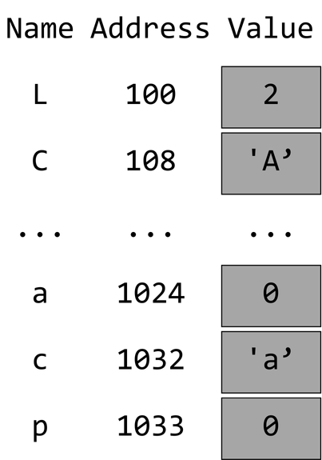

### Types & Variables

- Visualize variables as blocks in memory
- Each block associated with
  - Address
  - Value
- **Size** of variable determined by its type

```c
long L = 2;
const char C = 'A';
int main() {
    int a = 0;
    const char c = 'a';
    char* p = NULL;
}
```

---



---

### `sizeof` operator

- Primitive types have their size defined at compile time
- `sizeof` operator returns size of type/variable in bytes

```c
int main() {
      char a = '0';
      printf("%d", sizeof(a));
      printf("%d", sizeof(char));
      printf("%d", sizeof(int));
      printf("%d", sizeof(bool));
      printf("%d", sizeof(double));
      printf("%d", sizeof(char*));
      printf("%d", sizeof(long*));
      printf("%d", sizeof(void*));
}
```

```shell
output
```

---

### Compiling

```bash
gcc -Wall -Wextra -Wpedantic -std=c99 -o main main.c
```

- `-Wall` warnings
- `-Wextra` more warnings
- `-Wpedantic` strict ISO C compliance warnings
- `-std=c99` pick language standard ISO C99

---


- **Preprocessor** parses your `#include` and `#define` directives
- **Compiler** with assembler produce a machine instruction object file `.o` from a source code `.c` file
- **Linker** combines object files to a single executable `.out/.exe`

---

### Debugging

notes:

- hello world with some variables
- build on vscode with wsl
- configure and run gdb

---

### Operators

```c []
int main() {
    int a = 3 + 2;
    int b = 3 - 1;
    int c = a % b;
    printf("%d\n", c);
    int d = c++;
    printf("%d\n", d);
    d = --c;
    printf("%d\n", d);
    bool d = a < c;
    if (d) printf("less\n");
    else if (a == c) printf("equal\n");
    else printf("greater equal\n");
}
```

```shell
3
3
3
greater equal
```

---

- Think of each operator like a function
  - Takes one/two arguments
  - Returns a value
  - May modify the state of an argument

| Operator | x Type    | Y Type    | Return Type | Detail          |
| -------- | --------- | --------- | ----------- | --------------- |
| x < y    | numerical | numerical | boolean     | x, y share Type |
| x == y   | any       | any       | boolean     | x, y share Type |
| ++x      | integer   |           | integer     | modifies x      |

---

### Precedence & Associativity

- Precedence
  - Which is evaluated first
- Associativity
  - On same precedence, evaluate Left-to-Right or Right-to-Left

```c
int main() {
    int a = 3 * 2 + 1; // Precedence
    int b = 6;
    int c = 5;
    a = b = c = 10; // Associativity Right-to-Left
}
```

---

[C Operator Precedence Table](https://en.cppreference.com/w/c/language/operator_precedence)

### Scope

- Governs variable visibility
- Increases/Decreases on bracket open/close
  - Other rules can also cause scope change
- Each scope can access the variables of all open upper scopes
- Global scope is accessible by all

```c
const bool c = false;
int main() {
    int a = 1;
    {
        int b = 2;
        {
            int c = 3; // shadowing
              printf("%d %d %d\n", a, b, c);
        }
    }
    // a = b; //compiler error
}
```

```shell
1 2 3
```

---

### Enum - Typedef

- Enumerator
  - A type which can hold distinct values
- Typedef
  - Way to alias a type name

```c
      enum Color {
          Red,
          Green,
          Blue,
      };
      typedef enum Color Color;
      int main() {
        // enum Color c = Red; //Syntax without typedef
        printf("%d\n",sizeof(Color));
        Color c = Red;
        if (c == Red) print("Red\n");
        else if (c == Green) print("Green\n");
        else if (c == Blue) print("Blue\n");
        else print("Error\n");
      }
```

```shell
8
Red
```

---

### Switch

- if/else syntax suitable for enums/ints

```c
enum Color {
    Red,
    Green,
    Blue,
};
typedef enum Color Color;
int main() {
    c = Green;
    switch (c) {
        case Red:
            print(Red);
            break;
        case Green:
            print(Green);
            break;
        case Blue:
            print(Blue);
            break;
        default:
            print(Error);
    }
}
```

```shell
Green
```

---

### Loops

```c
int main() {
    const int limit = 10;
    int i = 0;
    while (i < limit) {
        printf("%d ", i);
        i += 1;
    }
    printf("\n");
    for (int i = 0; i < limit; ++i) printf("%d ", i);
    printf("\n");
    int j = 3;
    bool isDone = false;
    while(!isDone) {
        printf("{%d %d} \n", j, isDone);
        if (j > 0) { --j; continue; }
        isDone = true;
    }
    printf("\n");
    for(;;) break;
}
```

```shell
1 2 3 4 5
1 2 3 4 5
{3 0} {2 0} {1 0}
```

---

### Functions

- Reusable pieces of code

```c
bool IsEven(int val) {return val % 2;}
void PrintEven(int val, bool isEven) {
    if(isEven) printf("%d is Even\n", val, isEven);
}
int main() {
    for (int i = 0; i < 5; ++i)
        PrintEven(i, IsEven(i));
}
```

```shell
output here
```

---

### Call By Value

```c
void Increment(int val) {
    val += 1;
    printf("%d\n", val);
}
int main() {
    int i = 0;
    printf("%d\n", i);
    Increment(i);
    printf("%d\n", i);
}
```

```shell
0
1
0
```

Add blocks of memory on the right

---

### Pointers

We need a lot more backround before this example

- Holds an address in memory
- 8 byte size in 64-bit systems
- 4 byte size in 32-bit systems

```c
  int G = 1;
  int* const GPtr = &G;
  int main() {
    print(sizeof(int*))
    print(sizeof(char*))
    *GPtr += 1;
    print(GPtr)
    print(*GPtr)
    char c = '0';
    char* const cPtr = &c;
    print(cPtr)
    print(*cPtr)
    int* p = NULL;
    print(x);
    p = GPtr;
    *p +=1;
    print(x);
    print(*x);
  }
```

---

### Call By Reference trick

```c
void Increment(int* val) {
*val += 1;
printf("%d\n", \*val);
}
int main() {
int i = 0;
printf("%d\n", i);
Increment(&i);
printf("%d\n", i);
}
```

```shell
0
1
1
```

---

### Structs

- Allows definition of new type composed by simpler types
- size is at least the sum of the member field sizes

```c
struct Pair {
    int x;
    int y;
};
typedef struct Pair Pair;
int main() {
    printf("%d\n", sizeof(Pair));
    Pair pair1; //members uninitialized
    pair1.x = 1;
    pair1.y = 2;
    printf("%d %d\n", pair1.x, pair1.y);
    Pair pair2 = {.x=3, .y=4};
    printf("%d %d\n", pair2.x, pair2.y);
    Pair pair3 = pair2;
    printf("%d %d\n", pair3.x, pair3.y);
}
```

```shell
1 2
3 4
3 4
```

---

### C-Arrays

```c
struct Pair {
    int x;
    int y;
};
typedef struct Pair Pair;
#define PAIRS_SIZE 3
int main() {
    Pair pairs1[PAIRS_SIZE]; //elements uninitialized
    printf("%d\n", sizeof(pairs1));
    for (int i = 0; i < PAIRS_SIZE; ++i) { pairs[i].x=0; pairs[i].y=0; }
    Pair pairs2[PAIRS_SIZE] = { {1, 1}, {1, 1}, {1, 1} };
    Pair pairs3[PAIRS_SIZE] = {}; //elements initialized with zero
}
```

```shell
output
```

---

### C-Arrays as pointers

```c
#define NUMBERS_SIZE 10
PrintNumbers(int* nums) {
    for (int i = 0; i < NUMBERS_SIZE; ++i) printf("%d ", nums[i]);
}
int main() {
    int numbers[NUMBERS_SIZE] = {1, 2}; //rest initialized with zero
    PrintNumbers(numbers);
    printf("\n");
    int* const numbersAlias = numbers;
    numbersAlias[0] = 3;
    numbers[1] = 4;
    *(numbersAlias + 2) = 5;
    *(numbers + 3) = 6;
    int* const numberIndexFive = numbers + 5;
    *numberIndexFive = 7;
    PrintNumbers(numbers);
    printf("%p\n", &(numbers[6]));
    printf("%p\n", numbers + 6);
    printf("%p\n", &(numbersAlias[6]));
    printf("%p\n", numbersAlias + 6);
}
```

```shell
output
```

---

### Dynamic Allocation

```c
struct Pair {
    int x;
    int y;
};
typedef struct Pair Pair;
#define STR_SIZE 6
#define PAIRS_SIZE 3
int main() {
    int* numPtr = NULL;
    numPtr = malloc(1 * sizeof(int)); //returns pointer to uninitialized memory
    *numPtr = 1;
    *(numPtr + 0) = 2;
    int num = *numPtr;
    free(numPtr);

    char* str = malloc(STR_SIZE * sizeof(char));
    str[0]='H';str[1]='e';str[2]='l';str[3]='l';str[4]='o';str[5]='\0';
    printf("%s\n", str);
    memcpy(str, "World", STR_SIZE * sizeof(char)); //there is bug here
    printf("%s\n", str);
    free(str);

    Pair* pairs = malloc(PAIRS_SIZE * sizeof(Pair));
    memset(pairs, 0, PAIRS_SIZE * sizeof(Pair));
    pairs[0].x=1; pairs[0].y=1;
    *(pairs + 1).x=2; *(pairs + 1).y=2;
    Pair* pairsIndexTwo = pairs + 2;
    pairsIndexTwo->x=3; pairsIndexTwo->y=3;
    free(pairs);
}
```

```shell
output
```

---

### Defining a list

```c
struct Player {
    int id;
    int score;
    struct Player* next;
};
typedef struct Player Player;
struct PlayerList {
    Player* head;
};
typedef struct PlayerList PlayerList;
void PlayerList_Create() {
    PlayerList* list = malloc(sizeof(PlayerList));
    list->head = NULL;
    return list;
}
void PlayerList_Destroy(PlayerList* list) {
    PlayerList *prev = NULL;
    for (PlayerList curr = list->head; curr != NULL; curr = curr->next) {
        free(prev);
        prev = curr;
    }
    free(prev);
}
void PlayerList_Print(PlayerList* list) {
    for (PlayerList curr = list->head; curr != NULL; curr = curr->next)
        printf("{%p %d %d %p}", curr, curr->id, curr->score, curr->next)
}
void PlayerList_Insert(PlayerList* list, int id) {
    Player* node = malloc(sizeof(Player));
    node->id = id
    node->score = 0;
    node->next = NULL;

    node->next = list->head;
    list->head = node;
}
int main() {
    PlayerList* list = PlayerList_Create();
    PlayerList_Insert(list, 10);
    PlayerList_Print(list);
    PlayerList_Destroy(list);
}
```

```shell
output
```

---
